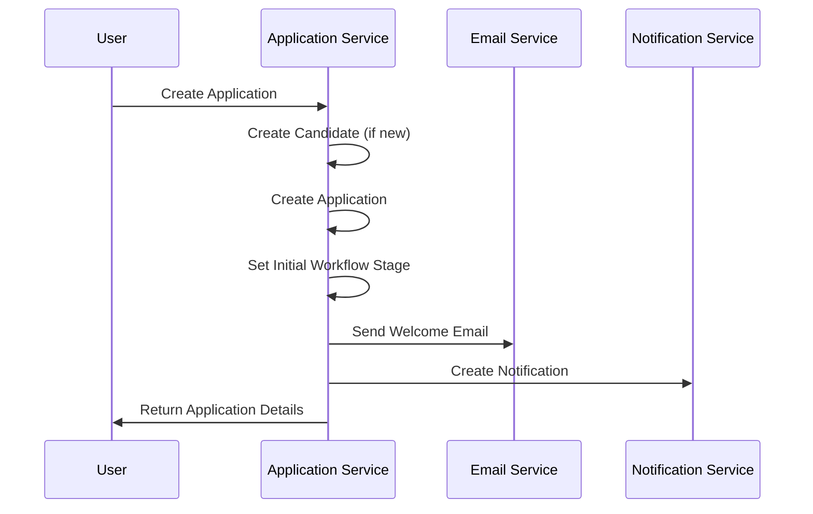
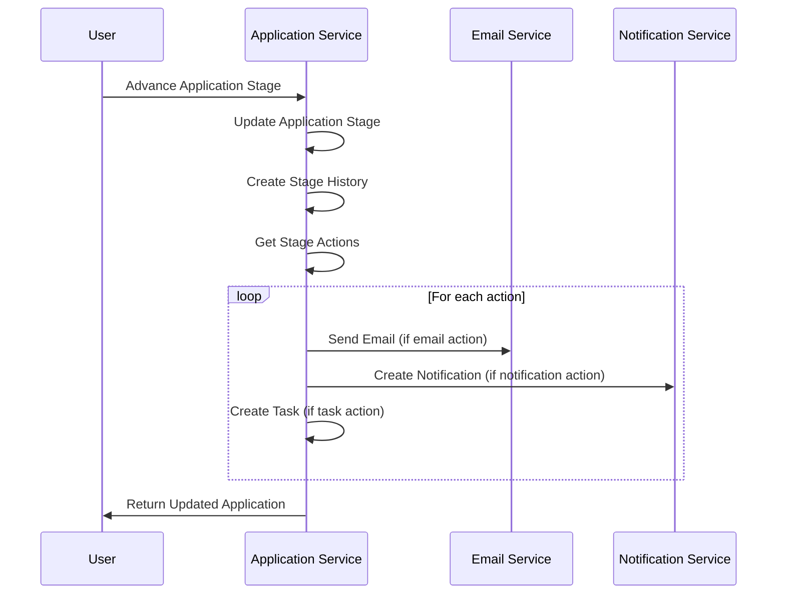

# ATS (Application Tracking System) - Complete Project Documentation

## 🎯 Project Overview

**ATS Simple Backend** is a comprehensive microservices-based Application Tracking System designed for modern recruitment workflows. The system provides end-to-end candidate and application management with automated workflow processing, email notifications, and real-time updates.

### 🏗️ Architecture

```
┌─────────────────────────────────────────────────────────────────┐
│                        ATS MICROSERVICES                        │
├─────────────────┬─────────────────┬─────────────────┬───────────┤
│  Auth Service   │ Application     │  Email Service  │   Notif   │
│     :8000       │   Service       │     :8002       │ Service   │
│                 │     :8001       │                 │   :8003   │
├─────────────────┼─────────────────┼─────────────────┼───────────┤
│ • JWT Auth      │ • Job Mgmt      │ • Templates     │ • In-app  │
│ • User Mgmt     │ • Applications  │ • Email Queue   │ • Real-time│
│ • Registration  │ • Candidates    │ • Analytics     │ • Alerts  │
│ • Permissions   │ • Workflows     │ • Automation    │ • Prefs   │
└─────────────────┴─────────────────┴─────────────────┴───────────┘
           │                │                │                │
           └────────────────┼────────────────┼────────────────┘
                           │                │
    ┌──────────────────────┼────────────────┼──────────────────┐
    │               INFRASTRUCTURE                              │
    ├─────────────────┬────────────────┬─────────────────────────┤
    │   PostgreSQL    │     Redis      │       RabbitMQ          │
    │     :5432       │     :6379      │    :5672 / :15672       │
    │                 │                │                         │
    │ • Primary DB    │ • Caching      │ • Message Queue         │
    │ • User Data     │ • Sessions     │ • Email Queue           │
    │ • Applications  │ • Temp Data    │ • Task Processing       │
    │ • Jobs & Teams  │ • Rate Limit   │ • Inter-service Comm    │
    └─────────────────┴────────────────┴─────────────────────────┘
```

## 🚀 Quick Start

### Prerequisites
- Docker & Docker Compose
- Python 3.10+
- Git

### Installation & Setup

1. **Clone Repository**
```bash
git clone <repository-url>
cd ats_simple_be
```

2. **Environment Setup**
```bash
cp .env.example .env
# Edit .env file with your configuration
```

3. **Start All Services**
```bash
docker-compose up -d
```

4. **Verify Services**
```bash
python test_all_services.py
```

### Service Endpoints
- **Auth Service**: http://localhost:8000
- **Application Service**: http://localhost:8001  
- **Email Service**: http://localhost:8002
- **Notification Service**: http://localhost:8003
- **PostgreSQL**: localhost:5432
- **Redis**: localhost:6379
- **RabbitMQ Management**: http://localhost:15672

## 📋 Services Documentation

### 1. Authentication Service (:8000)

**Purpose**: Centralized authentication, user management, and authorization

#### Features
- JWT-based authentication
- User registration and login
- Role-based permissions
- Password reset functionality
- User profile management

#### Key Endpoints
```
POST   /api/register/           - Register new user
POST   /api/login/             - User authentication
GET    /api/profile/           - Get user profile
PATCH  /api/profile/           - Update profile
GET    /api/users/             - List users (admin)
POST   /api/password-reset/    - Password reset
```

#### Models
- **User**: Extended Django user with additional fields
- **UserProfile**: Additional user information
- **Role**: User roles and permissions

---

### 2. Application Service (:8001)

**Purpose**: Core recruitment functionality with job management, candidate tracking, and workflow automation

#### Features
- **Job Management**: Complete job lifecycle with forms, teams, and workflows
- **Enhanced Candidate Profiles**: Skills, experience, education, file uploads
- **Application Processing**: Workflow-driven application management
- **Form Management**: Custom application forms with file support
- **Team Collaboration**: Team assignments and task management
- **Workflow Automation**: Stage-based processing with actions

#### Key Endpoints

##### Job Management
```
GET    /api/v1/jobs/                    - List all jobs
POST   /api/v1/jobs/                    - Create simple job
POST   /api/v1/jobs/complete/           - Create complete job with metadata
GET    /api/v1/jobs/{id}/               - Get job details
PATCH  /api/v1/jobs/{id}/               - Update job
DELETE /api/v1/jobs/{id}/               - Delete job
```

##### Candidate Management (Enhanced)
```
GET    /api/v1/candidates/              - List all candidates
POST   /api/v1/candidates/              - Create candidate
GET    /api/v1/candidates/{id}/         - Get candidate details
PATCH  /api/v1/candidates/{id}/         - Update candidate
DELETE /api/v1/candidates/{id}/         - Delete candidate
```

##### Application Management (V2 - Enhanced)
```
GET    /api/v1/v2/applications/                     - List applications (detailed)
POST   /api/v1/v2/applications/                     - Create application
GET    /api/v1/v2/applications/{id}/                - Get application details
PATCH  /api/v1/v2/applications/{id}/                - Update application
DELETE /api/v1/v2/applications/{id}/                - Delete application
POST   /api/v1/v2/applications/{id}/advance/        - Advance to next stage
POST   /api/v1/v2/applications/{id}/move-stage/     - Move to specific stage
```

##### Workflow Management
```
GET    /api/v1/workflow-templates/      - List workflow templates
POST   /api/v1/workflow-templates/      - Create workflow template
GET    /api/v1/workflow-steps/          - List workflow steps
GET    /api/v1/workflow-actions/        - List workflow actions
GET    /api/v1/workflow-tasks/          - List workflow tasks
```

#### Enhanced Models

##### Core Entities
- **Job**: Complete job information with relationships
- **Candidate**: Enhanced with skills, experience, education
- **Application**: Workflow-enabled with form answers
- **JobForm**: Custom application forms
- **FormField**: Individual form questions

##### Workflow System
- **WorkflowTemplate**: Job-specific workflow definitions
- **WorkflowStep**: Ordered workflow stages
- **WorkflowAction**: Automated actions (email, notification, task)
- **WorkflowTask**: Team tasks and assignments

##### Supporting Models
- **ApplicationStageHistory**: Complete audit trail
- **ApplicationFormAnswer**: Individual form responses
- **Society**: Company/organization information
- **Team**: Hiring teams and members

#### Workflow Processing

Applications automatically flow through defined stages:

1. **Application Received** → Send acknowledgment email
2. **Initial Screening** → Create screening task for HR
3. **Phone Screen** → Schedule phone interview
4. **Technical Interview** → Create technical assessment
5. **Final Interview** → Schedule with hiring manager
6. **Reference Check** → Create reference tasks
7. **Offer Made** → Send offer letter
8. **Hired** → Welcome email & onboarding

**Automated Actions**:
- **Email**: Template-based emails to candidates/team
- **Notification**: In-app notifications  
- **Task**: Task creation with assignments and due dates
- **Meeting**: Meeting/interview scheduling

---

### 3. Email Service (:8002)

**Purpose**: Email template management, queue processing, and analytics

#### Features
- Template-based email system
- Queue-based email processing
- Email analytics and tracking
- Celery integration for async processing
- Template variable substitution

#### Key Endpoints
```
GET    /api/templates/         - List email templates
POST   /api/templates/         - Create template
GET    /api/templates/{id}/    - Get template details
POST   /api/send/              - Send email
GET    /api/analytics/         - Email analytics
GET    /api/queue/status/      - Queue status
```

#### Background Workers
- **email_worker**: Process email queue
- **email_beat**: Schedule periodic tasks
- **email_queue_consumer**: RabbitMQ consumer

#### Models
- **EmailTemplate**: Template definitions
- **EmailLog**: Email sending history
- **EmailAnalytics**: Delivery and engagement metrics

---

### 4. Notification Service (:8003)

**Purpose**: Real-time notifications and user preferences

#### Features
- In-app notification system
- Real-time updates via WebSocket
- User notification preferences
- Notification categorization

#### Key Endpoints
```
GET    /api/notifications/           - List user notifications
POST   /api/notifications/           - Create notification
PATCH  /api/notifications/{id}/      - Mark as read
GET    /api/preferences/             - Get preferences
PATCH  /api/preferences/             - Update preferences
```

#### Models
- **Notification**: Individual notifications
- **NotificationPreference**: User preferences
- **NotificationCategory**: Notification types

## 🔄 Data Flow & Integration

### Application Creation Workflow



### Workflow Stage Advancement



## 📊 Database Schema

### Core Tables

#### Candidates
```sql
CREATE TABLE candidates (
    candidate_id SERIAL PRIMARY KEY,
    first_name VARCHAR(100) NOT NULL,
    last_name VARCHAR(100) NOT NULL,
    email VARCHAR(254) UNIQUE NOT NULL,
    phone VARCHAR(20),
    address TEXT,
    city VARCHAR(100),
    country VARCHAR(100),
    linkedin_url URL,
    portfolio_url URL,
    resume_file_path VARCHAR(500),
    cover_letter TEXT,
    parsed_cv_data JSONB,
    skills JSONB DEFAULT '[]',
    experience_years INTEGER,
    education JSONB DEFAULT '[]',
    work_experience JSONB DEFAULT '[]',
    certifications JSONB DEFAULT '[]',
    languages JSONB DEFAULT '[]',
    created_at TIMESTAMP DEFAULT NOW(),
    updated_at TIMESTAMP DEFAULT NOW()
);
```

#### Applications
```sql
CREATE TABLE applications (
    application_id SERIAL PRIMARY KEY,
    job_id INTEGER REFERENCES jobs(id),
    candidate_id INTEGER REFERENCES candidates(candidate_id),
    current_stage_id INTEGER REFERENCES workflow_steps(id),
    status VARCHAR(20) DEFAULT 'New',
    stage_order INTEGER DEFAULT 0,
    form_answers JSONB DEFAULT '{}',
    notes TEXT,
    internal_notes TEXT,
    source VARCHAR(100),
    rating INTEGER CHECK (rating >= 1 AND rating <= 5),
    tags JSONB DEFAULT '[]',
    is_starred BOOLEAN DEFAULT FALSE,
    is_archived BOOLEAN DEFAULT FALSE,
    applied_at TIMESTAMP DEFAULT NOW(),
    updated_at TIMESTAMP DEFAULT NOW(),
    processed_at TIMESTAMP,
    UNIQUE(job_id, candidate_id)
);
```

#### Workflow System
```sql
CREATE TABLE workflow_templates (
    id SERIAL PRIMARY KEY,
    job_id INTEGER UNIQUE REFERENCES jobs(id),
    template_id VARCHAR(100),
    template_name VARCHAR(255),
    name VARCHAR(255),
    description TEXT,
    created_at TIMESTAMP DEFAULT NOW()
);

CREATE TABLE workflow_steps (
    id SERIAL PRIMARY KEY,
    workflow_id INTEGER REFERENCES workflow_templates(id),
    step_id VARCHAR(100),
    step_name VARCHAR(255),
    step_description TEXT,
    order_num INTEGER DEFAULT 0,
    is_active BOOLEAN DEFAULT TRUE,
    created_at TIMESTAMP DEFAULT NOW()
);

CREATE TABLE workflow_actions (
    id SERIAL PRIMARY KEY,
    step_id INTEGER REFERENCES workflow_steps(id),
    action_id VARCHAR(100),
    action_name VARCHAR(255),
    action_type VARCHAR(50) CHECK (action_type IN ('email', 'notification', 'task', 'meeting')),
    action_description TEXT,
    email_template VARCHAR(100),
    action_details JSONB DEFAULT '{}',
    created_at TIMESTAMP DEFAULT NOW()
);
```

## 🔧 Configuration

### Environment Variables

```bash
# Database Configuration
DATABASE_HOST=postgres
DATABASE_NAME=ats_db
DATABASE_USER=ats_user
DATABASE_PASSWORD=ats_password
DATABASE_PORT=5432

# Redis Configuration
REDIS_HOST=redis
REDIS_PORT=6379
REDIS_DB=0

# RabbitMQ Configuration
RABBITMQ_HOST=rabbitmq
RABBITMQ_PORT=5672
RABBITMQ_USER=guest
RABBITMQ_PASSWORD=guest

# Email Configuration
EMAIL_BACKEND=django.core.mail.backends.smtp.EmailBackend
EMAIL_HOST=smtp.gmail.com
EMAIL_PORT=587
EMAIL_USE_TLS=True
EMAIL_HOST_USER=your-email@gmail.com
EMAIL_HOST_PASSWORD=your-app-password

# Security
SECRET_KEY=your-secret-key
DEBUG=False
ALLOWED_HOSTS=localhost,127.0.0.1

# Celery Configuration
CELERY_BROKER_URL=redis://redis:6379/0
CELERY_RESULT_BACKEND=redis://redis:6379/0
```

### Docker Compose Services

```yaml
services:
  # Infrastructure
  postgres:       # PostgreSQL database (:5432)
  redis:          # Redis cache & sessions (:6379)
  rabbitmq:       # Message queue (:5672, :15672)
  
  # Core Services
  auth_service:        # Authentication (:8000)
  application_service: # Application management (:8001)
  email_service:       # Email processing (:8002)
  notification_service: # Notifications (:8003)
  
  # Background Workers
  email_worker:        # Celery email worker
  email_beat:          # Celery scheduler
  email_queue_consumer: # RabbitMQ consumer
```

## 🧪 Testing

### Running Tests

```bash
# Test all services
python test_all_services.py

# Test specific service
python test_endpoints.py  # Application service only

# Run with Docker
docker-compose exec application_service python manage.py test
```

### Test Coverage

The test suite covers:
- ✅ Service health checks
- ✅ Authentication flows
- ✅ CRUD operations for all models
- ✅ Workflow processing
- ✅ Email sending
- ✅ Notification creation
- ✅ File upload handling
- ✅ Error handling and validation

## 🚀 Deployment

### Production Setup

1. **Environment Configuration**
```bash
# Set production environment variables
export DEBUG=False
export ALLOWED_HOSTS=your-domain.com
export DATABASE_URL=postgresql://user:pass@db:5432/ats_prod
```

2. **Database Migration**
```bash
docker-compose exec application_service python manage.py migrate
docker-compose exec auth_service python manage.py migrate
docker-compose exec email_service python manage.py migrate
```

3. **Static Files & Media**
```bash
docker-compose exec application_service python manage.py collectstatic
```

4. **Load Initial Data**
```bash
docker-compose exec email_service python manage.py load_email_templates
```

### Scaling Considerations

- **Database**: Use managed PostgreSQL (AWS RDS, Google Cloud SQL)
- **Redis**: Use managed Redis (AWS ElastiCache, Redis Cloud)
- **File Storage**: Use object storage (AWS S3, Google Cloud Storage)
- **Load Balancing**: Use nginx or cloud load balancers
- **Monitoring**: Implement logging, metrics, and health checks

## 📈 Performance & Monitoring

### Monitoring Endpoints

```bash
# Health checks
GET /health/          # All services
GET /metrics/         # Prometheus metrics (if enabled)
GET /status/          # Service status
```

### Performance Optimization

- **Database Indexing**: Optimized queries for large datasets
- **Caching**: Redis for frequent queries and sessions
- **Async Processing**: Celery for background tasks
- **File Handling**: Efficient file upload and storage
- **API Pagination**: Paginated responses for large lists

## 🔐 Security

### Authentication & Authorization

- **JWT Tokens**: Secure token-based authentication
- **Role-Based Access**: Granular permissions
- **Password Security**: Bcrypt hashing
- **Rate Limiting**: API rate limits (planned)

### Data Protection

- **Input Validation**: Comprehensive validation on all inputs
- **SQL Injection Prevention**: Django ORM protection
- **XSS Prevention**: Template auto-escaping
- **File Upload Security**: File type validation and scanning

## 🤝 API Integration

### Sample API Usage

#### Create Application with New Candidate
```python
import requests

# Create application with candidate data
response = requests.post(
    'http://localhost:8001/api/v1/v2/applications/',
    json={
        "job": 1,
        "candidate_data": {
            "first_name": "John",
            "last_name": "Doe", 
            "email": "john.doe@example.com",
            "skills": ["Python", "Django", "React"]
        },
        "form_answers": {
            "why_interested": "I'm passionate about this role...",
            "salary_expectation": "120000"
        },
        "source": "Company Website"
    },
    headers={"Authorization": "Bearer <your-token>"}
)
```

#### Advance Application Through Workflow
```python
# Move to next stage
response = requests.post(
    'http://localhost:8001/api/v1/v2/applications/1/advance/',
    headers={"Authorization": "Bearer <your-token>"}
)
```

#### Send Custom Email
```python
# Send email via email service
response = requests.post(
    'http://localhost:8002/api/send/',
    json={
        "to": ["candidate@example.com"],
        "template": "interview_invitation",
        "context": {
            "candidate_name": "John Doe",
            "interview_date": "2024-01-15",
            "interviewer": "Jane Smith"
        }
    }
)
```

## 📚 Additional Resources

### Documentation Files
- `API_DOCUMENTATION.md` - Detailed API documentation
- `APPLICATION_CANDIDATE_API.md` - Enhanced application endpoints
- `IMPLEMENTATION_SUMMARY.md` - Development summary
- `email_service/INTEGRATION.md` - Email service integration
- Individual service README files

### Development Tools
- `test_all_services.py` - Comprehensive test suite
- `test_endpoints.py` - Application service tests
- `docker-compose.yml` - Complete service orchestration
- `.env.example` - Environment configuration template

### Project Structure
```
ats_simple_be/
├── auth_service/           # Authentication microservice
├── application_service/    # Core application management
├── email_service/          # Email processing service
├── notification_service/   # Notification service
├── diagrams/              # System diagrams and schemas
├── docker-compose.yml     # Service orchestration
├── test_all_services.py   # Comprehensive testing
└── documentation/         # Project documentation
```

## 🎯 Future Enhancements

### Planned Features
- [ ] Real-time chat/messaging system
- [ ] Advanced analytics and reporting
- [ ] Mobile API endpoints
- [ ] Third-party integrations (LinkedIn, Indeed)
- [ ] AI-powered candidate matching
- [ ] Video interview integration
- [ ] Advanced workflow builder UI
- [ ] Multi-tenant support

### Technical Improvements
- [ ] GraphQL API option
- [ ] Kubernetes deployment configs
- [ ] Comprehensive monitoring setup
- [ ] API rate limiting
- [ ] Advanced caching strategies
- [ ] Full-text search capabilities
- [ ] Automated testing pipeline
- [ ] Performance optimization

---

## 📞 Support & Contact

For questions, issues, or contributions:
- Create GitHub issues for bugs or feature requests
- Review API documentation for implementation details
- Run test suites to verify functionality
- Check service logs for troubleshooting

**Project Repository**: [GitHub Link]
**Documentation**: Available in `/docs` directory
**Test Suite**: Run `python test_all_services.py`

---

*Last Updated: August 2025*
*Version: 1.0.0*
*Status: Production Ready*
