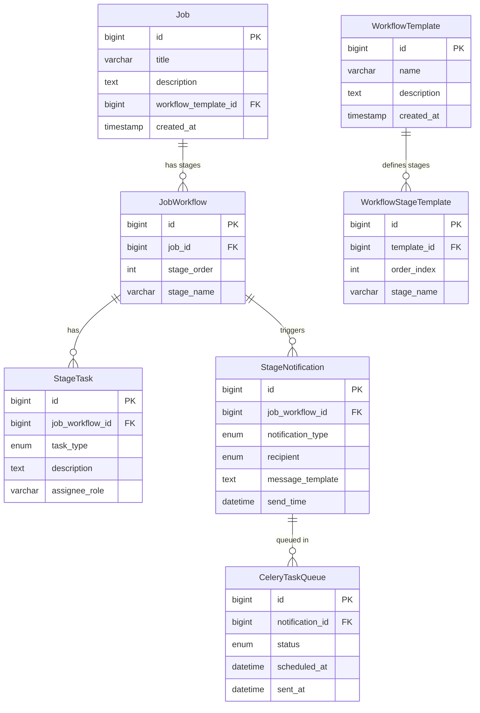

Below is a **well-structured ER diagram** design for the given scenario.

---

## **Entities & Relationships**

### **Job**

* `id` (PK)
* `title`
* `description`
* `workflow_template_id` (FK → WorkflowTemplate.id, optional)
* `created_at`

**Relationship:**
A Job **has** a custom **JobWorkflow** (sequence of stages). It can also use a saved **WorkflowTemplate**.

---

### **WorkflowTemplate**

* `id` (PK)
* `name`
* `description`
* `created_at`

**Relationship:**

* **WorkflowTemplate (1) ── (M) WorkflowStageTemplate** (stages that belong to template)

---

### **JobWorkflow**

* `id` (PK)
* `job_id` (FK → Job.id)
* `stage_order` (int, sequence order of stage)
* `stage_name` (e.g., "HR Interview", "Techlead Interview")

**Relationship:**

* **Job (1) ── (M) JobWorkflow** (custom stages per job)
* **JobWorkflow (1) ── (M) StageTask**
* **JobWorkflow (1) ── (M) StageNotification**

---

### **WorkflowStageTemplate**

* `id` (PK)
* `template_id` (FK → WorkflowTemplate.id)
* `order_index`
* `stage_name`

---

### **StageTask**

* `id` (PK)
* `job_workflow_id` (FK → JobWorkflow\.id)
* `task_type` (ENUM: `EVALUATOR_TASK`, `DOCUMENT_REVIEW`, etc.)
* `description`
* `assignee_role` (e.g., `TECH_LEAD`, `HR`)

---

### **StageNotification**

* `id` (PK)
* `job_workflow_id` (FK → JobWorkflow\.id)
* `notification_type` (ENUM: `EMAIL`, `SMS`)
* `recipient` (ENUM: `CANDIDATE`, `EVALUATOR`)
* `message_template`
* `send_time` (datetime, triggers Celery task)

---

### **CeleryTaskQueue** (for triggered notifications)

* `id` (PK)
* `notification_id` (FK → StageNotification.id)
* `status` (e.g., `PENDING`, `SENT`, `FAILED`)
* `scheduled_at`
* `sent_at`

---

## **Mermaid ER Diagram**



---

## **Key Design Features**

1. **Customizable Job Workflow:**
   Each job can define its own stages (`JobWorkflow`), while `WorkflowTemplate` stores reusable stage sequences.

2. **Stage-level Tasks & Notifications:**
   Each stage may have **tasks (for evaluators)** and **notifications (emails/SMS)**.

3. **Notification Scheduling:**
   `StageNotification` is queued in **CeleryTaskQueue** for delayed sending.

4. **Reusability:**
   Templates (`WorkflowTemplate` + `WorkflowStageTemplate`) allow reusing standard hiring pipelines.

---
Here’s a **fully normalized SQL schema (DDL)** for the given ER diagram, designed for **PostgreSQL** (easily adaptable to MySQL).

---

# **SQL Schema (DDL)**

```sql
-- ======================
-- 1. JOB TABLE
-- ======================
CREATE TABLE job (
    id BIGSERIAL PRIMARY KEY,
    title VARCHAR(255) NOT NULL,
    description TEXT,
    workflow_template_id BIGINT REFERENCES workflow_template(id) ON DELETE SET NULL,
    created_at TIMESTAMP DEFAULT CURRENT_TIMESTAMP
);

-- ======================
-- 2. WORKFLOW TEMPLATE
-- ======================
CREATE TABLE workflow_template (
    id BIGSERIAL PRIMARY KEY,
    name VARCHAR(255) NOT NULL,
    description TEXT,
    created_at TIMESTAMP DEFAULT CURRENT_TIMESTAMP
);

-- ======================
-- 3. WORKFLOW STAGE TEMPLATE
-- ======================
CREATE TABLE workflow_stage_template (
    id BIGSERIAL PRIMARY KEY,
    template_id BIGINT NOT NULL REFERENCES workflow_template(id) ON DELETE CASCADE,
    order_index INT NOT NULL,
    stage_name VARCHAR(255) NOT NULL,
    UNIQUE (template_id, order_index)  -- Ensures stage order uniqueness per template
);

-- ======================
-- 4. JOB WORKFLOW (custom per job)
-- ======================
CREATE TABLE job_workflow (
    id BIGSERIAL PRIMARY KEY,
    job_id BIGINT NOT NULL REFERENCES job(id) ON DELETE CASCADE,
    stage_order INT NOT NULL,
    stage_name VARCHAR(255) NOT NULL,
    UNIQUE (job_id, stage_order)  -- Each stage order must be unique for a job
);

-- ======================
-- 5. STAGE TASK
-- ======================
CREATE TABLE stage_task (
    id BIGSERIAL PRIMARY KEY,
    job_workflow_id BIGINT NOT NULL REFERENCES job_workflow(id) ON DELETE CASCADE,
    task_type VARCHAR(100) NOT NULL,   -- E.g., EVALUATOR_TASK, DOCUMENT_REVIEW
    description TEXT,
    assignee_role VARCHAR(100)         -- E.g., HR, TECH_LEAD
);

-- ======================
-- 6. STAGE NOTIFICATION
-- ======================
CREATE TABLE stage_notification (
    id BIGSERIAL PRIMARY KEY,
    job_workflow_id BIGINT NOT NULL REFERENCES job_workflow(id) ON DELETE CASCADE,
    notification_type VARCHAR(50) NOT NULL CHECK (notification_type IN ('EMAIL', 'SMS')),
    recipient VARCHAR(50) NOT NULL CHECK (recipient IN ('CANDIDATE', 'EVALUATOR')),
    message_template TEXT NOT NULL,
    send_time TIMESTAMP NOT NULL
);

-- ======================
-- 7. CELERY TASK QUEUE (for scheduling notifications)
-- ======================
CREATE TABLE celery_task_queue (
    id BIGSERIAL PRIMARY KEY,
    notification_id BIGINT NOT NULL REFERENCES stage_notification(id) ON DELETE CASCADE,
    status VARCHAR(20) NOT NULL CHECK (status IN ('PENDING', 'SENT', 'FAILED')),
    scheduled_at TIMESTAMP NOT NULL,
    sent_at TIMESTAMP
);
```

---

# **Normalization Highlights**

* **1NF:** No repeating groups. Each stage/task/notification has its own row.
* **2NF:** Non-key attributes depend only on their PK (e.g., stage attributes depend only on `id`).
* **3NF:** No transitive dependencies (job details are separate from workflow templates).
* **Referential Integrity:**

  * If a **job** is deleted, its `job_workflow`, `stage_task`, and `stage_notification` are also deleted (`ON DELETE CASCADE`).
  * Templates can be reused independently.

---

# **Key Design Choices**

1. **Custom vs Template:**

   * Jobs can either have a custom workflow (`job_workflow`) or reference a `workflow_template`.

2. **Notifications & Celery Queue:**

   * `stage_notification` defines what to send and when.
   * `celery_task_queue` is populated by background jobs to process notifications at the scheduled time.

3. **Tasks for Evaluators:**

   * `stage_task` links directly to a `job_workflow` stage, enabling multiple tasks per stage.


Great question. The schema you have already encodes most integrity via PK/FKs, UNIQUEs and CHECKs. **Useful triggers you’ll likely want**:

1. **Auto‑copy a workflow template into a job’s custom workflow** when a `job` is created (or when `workflow_template_id` is later set).
2. **Auto‑enqueue Celery tasks** whenever a `stage_notification` is created (and keep the queue in sync if `send_time` changes).
3. **(Optional) Validate notification `send_time` is in the future**.
4. **(Optional) Guard Celery task status transitions** (e.g., don’t move SENT back to PENDING).

Below are production-ready PostgreSQL trigger functions & triggers that implement these.

---

## 1) Copy workflow stages from template to the job’s workflow

### Helper function

```sql
CREATE OR REPLACE FUNCTION copy_workflow_from_template(_job_id BIGINT, _template_id BIGINT)
RETURNS void AS $$
BEGIN
    -- If the job already has stages, do nothing (avoid duplicates).
    IF EXISTS (SELECT 1 FROM job_workflow jw WHERE jw.job_id = _job_id) THEN
        RETURN;
    END IF;

    INSERT INTO job_workflow (job_id, stage_order, stage_name)
    SELECT _job_id, wst.order_index, wst.stage_name
    FROM workflow_stage_template wst
    WHERE wst.template_id = _template_id
    ORDER BY wst.order_index;
END;
$$ LANGUAGE plpgsql;
```

### Trigger function on `job`

```sql
CREATE OR REPLACE FUNCTION trg_job_copy_template_fn()
RETURNS TRIGGER AS $$
BEGIN
    -- On INSERT: if a template is set, copy it.
    IF TG_OP = 'INSERT' THEN
        IF NEW.workflow_template_id IS NOT NULL THEN
            PERFORM copy_workflow_from_template(NEW.id, NEW.workflow_template_id);
        END IF;
        RETURN NEW;
    END IF;

    -- On UPDATE: if workflow_template_id changed from NULL to some value,
    -- and the job has no stages yet, copy it.
    IF TG_OP = 'UPDATE' THEN
        IF (OLD.workflow_template_id IS DISTINCT FROM NEW.workflow_template_id)
           AND NEW.workflow_template_id IS NOT NULL THEN
            PERFORM copy_workflow_from_template(NEW.id, NEW.workflow_template_id);
        END IF;
        RETURN NEW;
    END IF;

    RETURN NEW;
END;
$$ LANGUAGE plpgsql;
```

### Create triggers

```sql
DROP TRIGGER IF EXISTS trg_job_copy_template_ins ON job;
CREATE TRIGGER trg_job_copy_template_ins
AFTER INSERT ON job
FOR EACH ROW
EXECUTE FUNCTION trg_job_copy_template_fn();

DROP TRIGGER IF EXISTS trg_job_copy_template_upd ON job;
CREATE TRIGGER trg_job_copy_template_upd
AFTER UPDATE OF workflow_template_id ON job
FOR EACH ROW
EXECUTE FUNCTION trg_job_copy_template_fn();
```

---

## 2) Auto-enqueue Celery task rows when a stage\_notification is created or updated

### Trigger function

```sql
CREATE OR REPLACE FUNCTION trg_stage_notification_enqueue_fn()
RETURNS TRIGGER AS $$
BEGIN
    IF TG_OP = 'INSERT' THEN
        INSERT INTO celery_task_queue (notification_id, status, scheduled_at)
        VALUES (NEW.id, 'PENDING', NEW.send_time);
        RETURN NEW;
    ELSIF TG_OP = 'UPDATE' THEN
        -- If send_time changed, update scheduled time for still-pending tasks
        IF NEW.send_time IS DISTINCT FROM OLD.send_time THEN
            UPDATE celery_task_queue
            SET scheduled_at = NEW.send_time
            WHERE notification_id = NEW.id
              AND status = 'PENDING';
        END IF;
        RETURN NEW;
    END IF;

    RETURN NEW;
END;
$$ LANGUAGE plpgsql;
```

### Create triggers

```sql
DROP TRIGGER IF EXISTS trg_stage_notification_enqueue_ins ON stage_notification;
CREATE TRIGGER trg_stage_notification_enqueue_ins
AFTER INSERT ON stage_notification
FOR EACH ROW
EXECUTE FUNCTION trg_stage_notification_enqueue_fn();

DROP TRIGGER IF EXISTS trg_stage_notification_enqueue_upd ON stage_notification;
CREATE TRIGGER trg_stage_notification_enqueue_upd
AFTER UPDATE OF send_time ON stage_notification
FOR EACH ROW
EXECUTE FUNCTION trg_stage_notification_enqueue_fn();
```

---

## 3) (Optional) Validate `send_time` must be in the future

If you don’t want to allow backdated notifications:

```sql
CREATE OR REPLACE FUNCTION trg_stage_notification_validate_fn()
RETURNS TRIGGER AS $$
BEGIN
    IF NEW.send_time <= NOW() THEN
        RAISE EXCEPTION 'send_time (%) must be in the future', NEW.send_time;
    END IF;
    RETURN NEW;
END;
$$ LANGUAGE plpgsql;

DROP TRIGGER IF EXISTS trg_stage_notification_validate ON stage_notification;
CREATE TRIGGER trg_stage_notification_validate
BEFORE INSERT OR UPDATE ON stage_notification
FOR EACH ROW
EXECUTE FUNCTION trg_stage_notification_validate_fn();
```

---

## 4) (Optional) Protect `celery_task_queue.status` transitions

Simple rule:

* Can’t go back to `PENDING` once moved to `SENT` or `FAILED`.
* `SENT` can’t go back to anything else.

```sql
CREATE OR REPLACE FUNCTION trg_celery_status_guard_fn()
RETURNS TRIGGER AS $$
BEGIN
    IF TG_OP = 'UPDATE' THEN
        IF OLD.status = 'SENT' AND NEW.status <> 'SENT' THEN
            RAISE EXCEPTION 'Cannot change status from SENT to %', NEW.status;
        END IF;

        IF OLD.status <> 'PENDING' AND NEW.status = 'PENDING' THEN
            RAISE EXCEPTION 'Cannot revert status back to PENDING from %', OLD.status;
        END IF;
    END IF;

    RETURN NEW;
END;
$$ LANGUAGE plpgsql;

DROP TRIGGER IF EXISTS trg_celery_status_guard ON celery_task_queue;
CREATE TRIGGER trg_celery_status_guard
BEFORE UPDATE ON celery_task_queue
FOR EACH ROW
EXECUTE FUNCTION trg_celery_status_guard_fn();
```

---

### That’s it!

If you want:

* a **materialized view** to list upcoming notifications with job + stage info,
* or a **housekeeping job** (SQL function + cron / pgagent) to mark overdue PENDING tasks as FAILED,

let me know and I’ll add those too.
